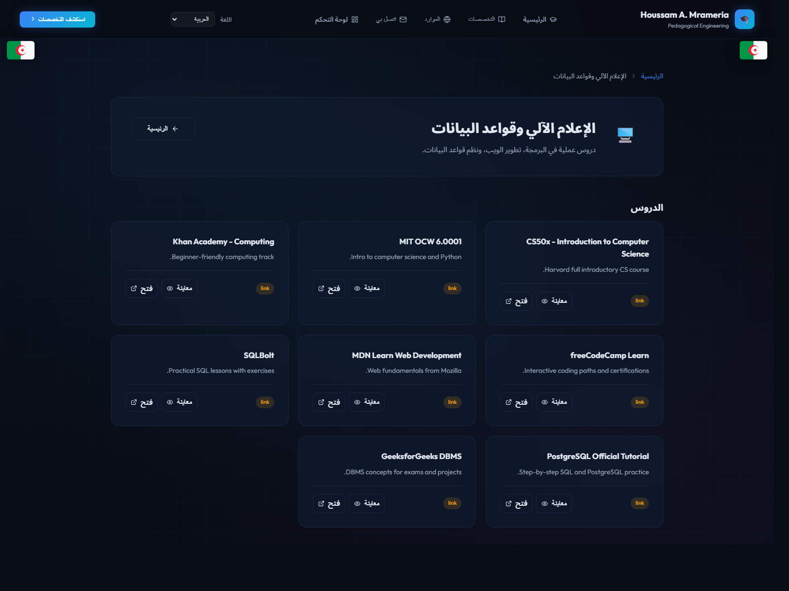

# Professor Portal

بوابة أكاديمية مبنية بـ `React + Vite` لدعم المحتوى التعليمي، الموارد، والتخصصات.

## المميزات

- واجهة عربية/ثنائية اللغة.
- قسم موارد تعليمية وروابط داعمة.
- تنظيم المحتوى حسب التخصصات.
- لوحة تحكم للمحتوى (حسب بنية المشروع الحالية).

## التشغيل محليًا

```bash
npm install
npm run dev
```

ثم افتح:

`http://localhost:5173`

## أوامر مهمة

```bash
# تشغيل وضع التطوير
npm run dev

# بناء نسخة الإنتاج
npm run build

# معاينة نسخة الإنتاج
npm run preview
```

## بنية المشروع

- `src/` مكونات الواجهة والصفحات والسياق.
- `public/` الصور والأصول الثابتة.
- `src/data/` بيانات المحتوى والترجمات.

## صور الواجهة

### الصفحة الرئيسية


### قسم الموارد


### صفحة التخصصات


## ملاحظات

- المشروع يعتمد `Vite`، لذلك الإقلاع سريع في التطوير.
- إذا ظهرت مشكلة في الحزم، احذف `node_modules` ثم أعد `npm install`.
